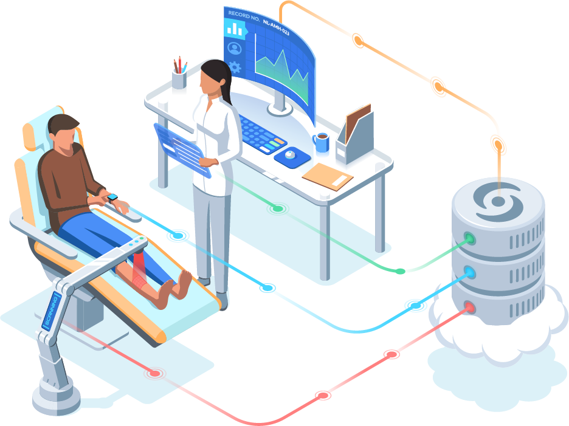
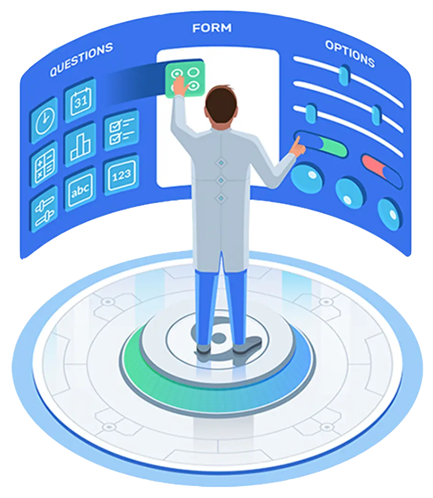

# Electronic Data Capture (EDC) System 

## Introduction
The EDC is a research management tool that allows researchers to collect data from participants in a study. The EDC is 
an application that allows researchers to create and manage studies, and participants to complete study activities. In 
our implementation, the system can be divided into two main components:
- User and Study Management
- Data Collection
- Data Export and Persistence

Image credit: https://www.castoredc.com/

## User and Study Management
The users of the system are researchers and participants. Researchers can create studies, and participants can
participate in studies. The system allows researchers to create studies, and participants to participate in studies.
Each user has a unique username. This is used for user to login to the system. However, the username is considered
private information and is not displayed to other users. Instead, each user has a unique identifier that is used to
identify the user in the system. This identifier is displayed to other users, and it is used in the system to identify
and retrieve information about the user.

The EDC system allows researchers to create and manage studies. A study is a collection of activities that are
associated with a particular research project. A study can be created by a researcher, and then shared with other
researchers. A study can be shared with other researchers by adding them as collaborators (enroll additional 
researchers). A researcher can be enrolled to multiple studies. A researcher can be removed from a study by the
other researchers in the study, but cannot remove themselves from a study. The researcher of a study has the authority
to specify the study attributes, such as the study name, description, and the type of the study. The researcher can
can modify all study attributes, except for the study type, at any time before the first enrollment of a participant. A
study can be closed by the researcher at any time. Once a study is closed, they study is archived and no longer
available for enrollment. A study can be reopened by the researcher at any time at the researcher's discretion.

The EDC system allows participants to participate in studies. A participant can participate in only one study. It means
that a participant account can be enrolled to only one study. However, an actual participant user can participate in
multiple studies by creating multiple participant accounts. A participant can be added to a study by a researcher as a
potential participant. A potential participant can be enrolled to a study by a researcher as an actual participant once
they complete and meet the eligibility criteria of the study at the researcher's discretion. The exact enrolment
process is determined by the study type. For a general study, a potential participant can be enrolled to a study where
the researcher specify the group that the participant is enrolled to. For a randomized study, a potential participant
can be enrolled to a study where the system randomly assigns the participant to a group following a specified
randomization scheme.

However, to ensure the stability of the data and ensure that the system keeps tracks all aspects of the study, the
system does not allow the deletion of a study or the deletion of an account. This is to ensure that the system is
consistent with the ICH Good Clinical Practice (GCP) guidelines.

## Data Collection
Everything after login is considered a study activity. They are performed once a specified study is selected.

The EDC system allows researchers to create and manage activities. An activity is a collection of questions that are
associated with a particular study. A questionnaire can be created by a researcher, and at the time of creation, the
researcher can specify the tile, description, and the type of the questionnaire (eligibility, or regular). However, for
either type, there is no difference in the way that this questionnaire object is created (same entity class). They only
differ in the way that they are used. When the questionnaire is being created, the researcher can add questions to the
questionnaire, these questions can be open-ended text questions, multiple choice questions, or a scale question. Each
type of question has its own set of attributes. For example, a multiple choice question has a list of choices, and a
scale question has a scale ranging from 0 to a user-specified value. Once a questionnaire is created, it is not 
considered complete. At this time, the researchers can modify the questionnaire by adding or removing questions. A 
questionnaire is final when it is published. Once a questionnaire is published, it cannot be modified, and it can be
assigned to a participant.

The EDC system allows participants to complete questionnaires. A participant can see the list of questionnaires that
are assigned to them. A participant can complete a questionnaire by answering all of the questions in the questionnaire.
Once a questionnaire is completed, it is submitted to the system. The system will then record the answers as well as
the time and the user who complete the questionnaire. This is self-reported data. Researchers can also complete
questionnaires on behalf of participants. This is considered as a proxy-reported data. The researchers, but not the
participants, have the authority to modify the answers of a questionnaire. This is to allow the researchers to correct
the answers of a questionnaire if the participant made a mistake. However, this will generate a new record of the
(version) of the answer. A reason for modification must be detailed. This is to ensure that the system keeps track of 
all the changes that are made to the answers, and to ensure that the system is consistent with the ICH GCP guidelines.

Image credit: https://www.castoredc.com/

## Data Export and Persistence
The EDC system allows researchers to export the data collected from the participants. The data can be exported in
the csv format for further analysis. The data can be exported by the researcher at any time. The exported data is specific
to the study that is selected, and all current versions of the answers are exported. One csv file is generated for each
questionnaire. The csv file contains the answers of all participants who have completed the questionnaire.

Persistence is achieved by storing the data using serialization. The data is stored in the form of a binary file. The
entire system data (as in all the entities and random group generators) is stored in a single file.

# Project Template

This is a template repository for CSC 207 projects. 
This repository contains starter code for a gradle project.
It also contains workflow documents that give instructions on how to manage your Github repository and how to use Github Projects for efficient collaboration.

## Checklist For Your Project
- [ ] Verify the correct settings for your project repository
- [ ] Set up Github Projects
- [ ] Create the implementation plan using issues and Github Projects
- [ ] Create development branches for your features
- [ ] Use pull requests to merge finished features into main branch
- [ ] Conduct code reviews

**If your team has trouble with any of these steps, please ask on Piazza. For example, with how GitHub Classroom works, your team *may* not have permissions to do some of the first few steps, in which case we'll post alternative instructions as needed.**

## Workflow Documents

* Github Workflow: Please refer to the workflow that was introduced in the first lab. You should follow this when working on your code. The following document provides additional details too.

* [Project Planning and Development Guide](project_plan_dev.md): This document helps you to understand how to create and maintain a project plan for your class project. **This document helps you to complete the Implementation Plan Milestone.**

## Gradle Project
Import this project into your Intellij editor. It should automatically recognise this as a gradle repository.
The starter code was built using SDK version 11.0.1. Ensure that you are using this version for this project. (You can, of course, change the SDK version as per your requirement if your team has all agreed to use a different version)

You have been provided with two starter files for demonstration: HelloWorld and HelloWorldTest.

You will find HelloWorld in `src/main/java/tutorial` directory. Right click on the HelloWorld file and click on `Run HelloWorld.main()`.
This should run the program and print on your console.

You will find HelloWorldTest in `src/test/java/tutorial` directory. Right click on the HelloWorldTest file and click on `Run HelloWorldTest`.
All tests should pass. Your team can remove this sample of how testing works once you start adding your project code to the repo.

Moving forward, we expect you to maintain this project structure. You *should* use Gradle as the build environment, but it is fine if your team prefers to use something else -- just remove the gradle files and push your preferred project setup. Assuming you stick with Gradle, your source code should go into `src/main/java` (you can keep creating more subdirectories as per your project requirement). Every source class can auto-generate a test file for you. For example, open HelloWorld.java file and click on the `HelloWorld` variable as shown in the image below. You should see an option `Generate` and on clicking this your should see an option `Test`. Clicking on this will generate a JUnit test file for `HelloWorld` class. This was used to generate the `HelloWorldTest`.

You can create another simple class and try generating a test for this class.
