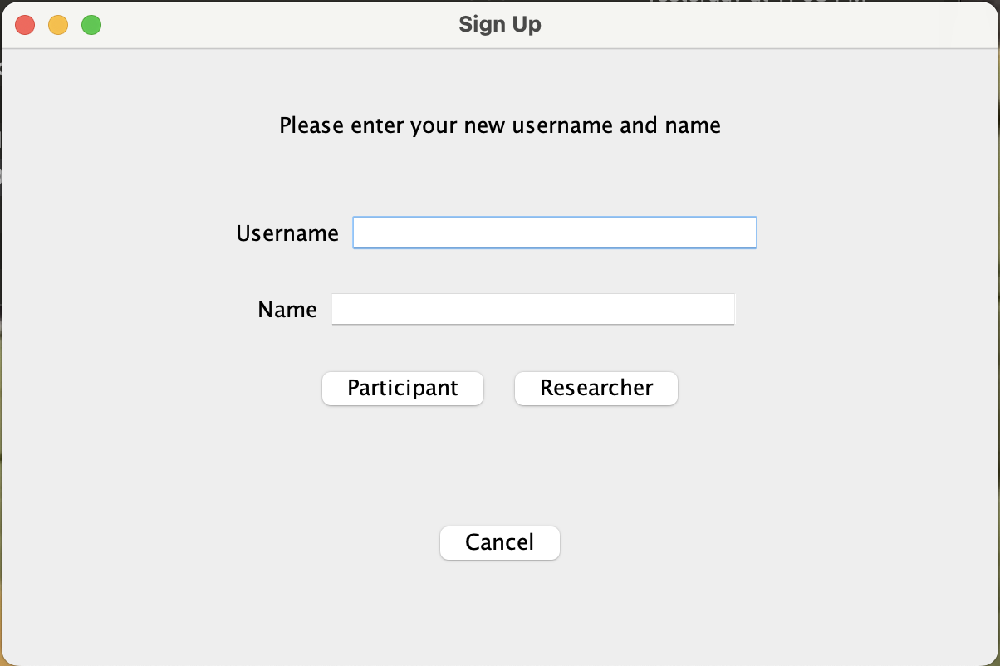
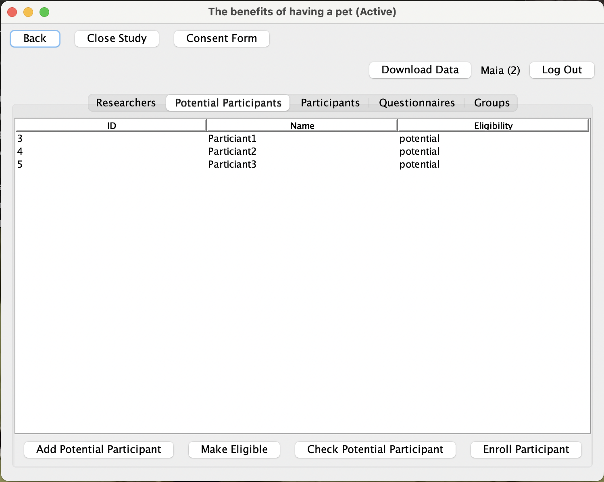

# Electronic Data Capture (EDC) System 

## Introduction
The EDC is a research management tool that allows researchers to collect data from participants in a study. The EDC is 
an application that allows researchers to create and manage studies, and participants to complete study activities. In 
our implementation, the system can be divided into two main components:
- User and Study Management
- Data Collection
- Data Export and Persistence

Image credit: https://www.castoredc.com/

### User and Study Management
The users of the system are researchers and participants. Researchers can create studies, and participants can
participate in studies. The system allows researchers to create studies, and participants to participate in studies.
Each user has a unique username. This is used for user to login to the system. However, the username is considered
private information and is not displayed to other users. Instead, each user has a unique identifier that is used to
identify the user in the system. This identifier is displayed to other users, and it is used in the system to identify
and retrieve information about the user.

The EDC system allows researchers to create and manage studies. A study is a collection of activities that are
associated with a particular research project. A study can be created by a researcher, and then shared with other
researchers. A study can be shared with other researchers by adding them as collaborators (enroll additional 
researchers). A researcher can be enrolled to multiple studies. A researcher can be removed from a study by the
other researchers in the study, but cannot remove themselves from a study. The researcher of a study has the authority
to specify the study attributes, such as the study name, description, and the type of the study. The researcher can
can modify all study attributes, except for the study type, at any time before the first enrollment of a participant. A
study can be closed by the researcher at any time. Once a study is closed, they study is archived and no longer
available for enrollment. A study can be reopened by the researcher at any time at the researcher's discretion.

The EDC system allows participants to participate in studies. A participant can participate in only one study. It means
that a participant account can be enrolled to only one study. However, an actual participant user can participate in
multiple studies by creating multiple participant accounts. A participant can be added to a study by a researcher as a
potential participant. A potential participant can be enrolled to a study by a researcher as an actual participant once
they complete and meet the eligibility criteria of the study at the researcher's discretion. The exact enrolment
process is determined by the study type. For a general study, a potential participant can be enrolled to a study where
the researcher specify the group that the participant is enrolled to. For a randomized study, a potential participant
can be enrolled to a study where the system randomly assigns the participant to a group following a specified
randomization scheme.

However, to ensure the stability of the data and ensure that the system keeps tracks all aspects of the study, the
system does not allow the deletion of a study or the deletion of an account. This is to ensure that the system is
consistent with the ICH Good Clinical Practice (GCP) guidelines.

### Data Collection
Everything after login is considered a study activity. They are performed once a specified study is selected.

The EDC system allows researchers to create and manage activities. An activity is a collection of questions that are
associated with a particular study. A questionnaire can be created by a researcher, and at the time of creation, the
researcher can specify the tile, description, and the type of the questionnaire (eligibility, or regular). However, for
either type, there is no difference in the way that this questionnaire object is created (same entity class). They only
differ in the way that they are used. When the questionnaire is being created, the researcher can add questions to the
questionnaire, these questions can be open-ended text questions, multiple choice questions, or a scale question. Each
type of question has its own set of attributes. For example, a multiple choice question has a list of choices, and a
scale question has a scale ranging from 0 to a user-specified value. Once a questionnaire is created, it is not 
considered complete. At this time, the researchers can modify the questionnaire by adding or removing questions. A 
questionnaire is final when it is published. Once a questionnaire is published, it cannot be modified, and it can be
assigned to a participant.

The EDC system allows participants to complete questionnaires. A participant can see the list of questionnaires that
are assigned to them. A participant can complete a questionnaire by answering all of the questions in the questionnaire.
Once a questionnaire is completed, it is submitted to the system. The system will then record the answers as well as
the time and the user who complete the questionnaire. This is self-reported data. Researchers can also complete
questionnaires on behalf of participants. This is considered as a proxy-reported data. The researchers, but not the
participants, have the authority to modify the answers of a questionnaire. This is to allow the researchers to correct
the answers of a questionnaire if the participant made a mistake. However, this will generate a new record of the
(version) of the answer. A reason for modification must be detailed. This is to ensure that the system keeps track of 
all the changes that are made to the answers, and to ensure that the system is consistent with the ICH GCP guidelines.

Image credit: https://www.castoredc.com/

### Data Export and Persistence
The EDC system allows researchers to export the data collected from the participants. The data can be exported in
the csv format for further analysis. The data can be exported by the researcher at any time. The exported data is specific
to the study that is selected, and all current versions of the answers are exported. One csv file is generated for each
questionnaire. The csv file contains the answers of all participants who have completed the questionnaire.

Persistence is achieved by storing the data using serialization. The data is stored in the form of a binary file. The
entire system data (as in all the entities and random group generators) is stored in a single file.

## Getting Started
### Run the Main!
The main class is the entry point of the EDC system. The main class is located in the `Main` class in the `main` package.
The main class is responsible for initializing the system, and starting the system. Upon starting the system, a screen
will be displayed to the user to choose to login in or to register. The user can also choose to exit the system simply
by pressing the `x` button on the screen.

### Login and Register
The registration process is simple. The user will be prompted to enter a username and the name of the user. The user
will then need to choose the type of the account. Pressing each button in the type selection will directly register the
user if the username is not taken. A valid username is a string that contains only alphanumeric characters and is 
case-sensitive. However, we do not post strong restrictions on the username. Using the `cancel` button will direct the user 
back to the login screen.

The login process is simple. The user will be prompted to enter a username. That's it! If the username is valid, the
user will be logged in. If the username is invalid, the user will be prompted to enter a valid username. The system will
automatically check the user type and direct the user to the appropriate screen. If the user is a researcher, the user
will be directed to the researcher screen that lists all the studies that the user is enrolled to. If the user is a
participant, the user will be directed to the participant screen that lists all the questionnaires that are assigned to
the user if the participant is associated with a study (enrolled, or as a potential participant). If the user is not
associated with a study, the user will be directed to a screen indicating their non-enrollment status. 

### Study Management
After logging in, the researcher will be directed to the study management screen. The study management screen lists
all the studies that the researcher is enrolled to. The researcher can select a study to view the details of the study.
The researcher can also create a new study by pressing the `create study` button. The researcher can also modify the
study by pressing the `modify study` button upon a study selection. In the study modification screen, the researcher
can modify the study attributes, such as the study name, description, the target number of participants, and the 
grouping scheme. However, the type of the study cannot be modified. The attributes of the study can be modified only
before the enrollment of the first participant.

Upon the selection of a existing study, or the creation of a new study, the researcher will be directed to the study log
screen. The study log screen lists all the information related to the study. This includes, in separate panels, the
list of all researchers, the list of all participants, the list of all potential participants, the list of all 
questionnaires, as well as the grouping scheme. Most of the features in this screen are self-explanatory. The
grouping scheme panel is a bit more complicated. The grouping scheme panel lists all the groups that are created
by the grouping scheme. Depending on the type of the study, the grouping scheme panel will display different
information. For a general study, the grouping scheme panel will display the list of groups that are created by the
grouping scheme. There is no additional functionality embedded. For a randomized study, the grouping scheme panel
also includes the button to `select randomization strategy`. The researcher can select a randomization strategy
from the list of available strategies, before the enrollment of the first participant. If the strategy is 'stratified
randomization', another button will be displayed to `select stratification criteria`. The researcher can select a
a stratification variable from the scale or multiple choice questions in the eligibility questionnaire. However, the 
system do not enforce the type of question associated with this variable, so it is up to the researcher to ensure that
the variable is a scale or multiple choice question. Again, this can only be done before the enrollment of the first
participant. The information about the randomization strategy and the stratification criteria will be displayed in the
panel.

The researcher can close the study by pressing the `close study` button. Closing a study will archive the study. A
researcher in the study can reopen the study by pressing the `reopen study` button at their own discretion. Additionally,
a researcher can remove other researchers from the study by pressing the `remove researcher` button.

### Questionnaire Management
There are several functionalities that are available to the researcher in the questionnaire management panel.

#### Create Questionnaire
The researcher can create a new questionnaire by pressing the `add questionnaire` button. The researcher will be
prompted to enter the name of the questionnaire and its description. Here, the researcher can add an arbitrary number
of questions to the questionnaire. The researcher can add a question by pressing the `add question` button. The system
currently supports three types of questions: text, scale and multiple choice. The researcher can select the type of the 
question by pressing the corresponding button. Regardless of the type of the question, the researcher will be prompted
to enter the question content and the variable name. The variable name is used to identify the question in the data
export. The variable name must be unique within the questionnaire.
- Text: The question creation screen for text question is a simple text field.
- Scale: The question creation screen for scale question is a bit more complicated. The researcher will be prompted
to enter `scale range`, which will generate the scale from `0` to `scale range - 1`.
- Multiple Choice: The researcher will be prompted to enter the `number of choices`. The researcher can then enter
the choices one by one. The answer to the multiple choice question will be the index of the choice (starting from 1),
i.e. the first choice will be `1`, the second choice will be `2`, and so on.

A question can be removed by pressing the `delete question` button. 

Upon finishing adding the questions, the researcher can press the `create questionnaire` button to create a `general
questionnaire`, which can be assigned to enrolled participants. The researcher can also create a eligibility 
questionnaire by pressing the `create eligibility questionnaire` that is used to determine the eligibility of the
potential participants.

#### Modify Questionnaire
The researcher can modify the questionnaire by pressing the `edit questionnaire` button. The researcher can modify 
the name and the description of the questionnaire, as well as the questions. Previously added questions can be
removed by pressing the `delete previous question` button. The researcher can also add new questions by pressing the
`add question` button. These newly added questions will be appended to the end of the questionnaire, and can be deleted
without being saved to the questionnaire by pressing the `delete question` button. The researcher can save the changes
by pressing the `save questionnaire` button.

#### Publish Questionnaire
Upon the creation of a questionnaire, the questionnaire will be in the `draft` state. This is identified by the status
of `unpublished` in the questionnaire list. To check the content of the questionnaire, the researcher can select the
questionnaire and press the `check questionnaire` button, or the `check eligibility questionnaire` button for the 
eligibility questionnaire. At this point, the researcher can publish the questionnaire by pressing the `publish
questionnaire` button. The questionnaire will be published and the status will be changed to `published`. This means
that the questionnaire can no longer be modified and can be assigned to the participants. Once published, the
questionnaire can be closed by pressing the `close questionnaire` button. This means that the questionnaire will be
no longer available for assignment or answering.

Before an eligibility questionnaire is published, the researcher must create a consent form. The consent form will be
displayed to the potential participants before they answer the eligibility questionnaire.

#### Assign Questionnaire
After publishing the questionnaire, the researcher can assign the questionnaire to the participants. The researcher
can assign the questionnaire to the participants by pressing the `assign questionnaire` button. The researcher will
be prompted to select the participants to whom the questionnaire will be assigned. These can be `all` participants in
the study, or a `group` of participants. The researcher can also specify a certain participant by entering the `ID` of
the participant.

### Participant Management
The researcher can manage the participants in the two panels: `participants` and `potential participants`. The
participants panel lists all the participants that are enrolled in the study. The researcher can select a participant
to view the details of the participant. The potential participants panel lists all the potential participants that
have not been enrolled in the study. The researcher can select a potential participant to check the eligibility of
the potential participant. The participant enrollment process is as follows:

1. _**Add a potential participant**_ by pressing the `add potential participant` button. The researcher will be prompted to
enter the `ID` of the potential participant. The `ID` must indicate a participant that is not already associated with
a study. The system will check the `ID` and respond with the name of the potential participant. The researcher can
then press the `add` button to add the potential participant to the study. If the study has an already published
eligibility questionnaire, all added potential participants will be automatically assigned the eligibility questionnaire.
Otherwise, when the researcher publishes the eligibility questionnaire, all added potential participants will be
also assigned the eligibility questionnaire.

2. _**Check the eligibility**_ of the potential participant by pressing the `check potential participant` button. This
will allow the researcher to check the answers to the eligibility questionnaire. Then, the researcher can press the
`make eligible` button to make the potential participant eligible if they determine that the potential participant 
satisfies the eligibility criteria.

3. _**Enroll the participant**_ by pressing the `enroll participant` button. This will enroll the participant in the 
study only for the potential participants that are eligible. In a general study, the researcher can assign the
group to the participant, in which the group were defined previously when the study is created. In a randomized
study, the group will be assigned automatically by an embedded algorithm that is based on the randomization
strategy and the stratification criteria.

### Answer Management
A participant can answer the assigned questionnaires by pressing the `answer questionnaire` button in the `assigned
questionnaires` panel. The participant will be prompted to answer the questions in the questionnaire. The participant is
not allowed to skip a question. They can answer the questionnaire once and only once. Upon answering the questionnaire,
the questionnaire will be automatically move to the `completed questionnaires` panel, where the participant can view
the answers to the questionnaire.

A researcher can view the answers to the questionnaire by first selecting a participant where they press the
`check participant` button. The researcher can then select the questionnaire to view the answers to the questionnaire by
pressing the `check answers` button. The researcher also has the authority to answer the questionnaire on behalf of
the participant by pressing the `answer questionnaire` button in the `assigned questionnaires` panel. If the researcher
believes that the participant has answered the questionnaire incorrectly, the researcher can press the `modify answers`
button to modify the answers to the questionnaire. However, the researcher must specify the reason for modifying the
answers. This will generate a new version of the answers on top of the previous version. Here, we store each version
in the `VersionedAnswer` object, where the `Answer` object is a collection of `VersionedAnswer` objects. Each `Answer`
object is associated corresponds to a `Questionnaire` and a `Participant`. Both the researchers and the participants
can view the history of the answers. The `VersionedAnswer` keeps track of the `version` of the answer, the `reason` for
modifying the answer, the `timestamp` of the modification, as well as the user who made the modification (including the
initial answer).

### Data Export
All the data collected in the study can be exported by pressing the `download data` button. The researcher will be able
to download the data in the `csv` format. Currently, our system only supports the export the current data, i.e., these
are the most current `version` of the answers. The researcher will be able to choose a directory to save the data. In 
there, all existing `answers` to each questionnaire for all participants will be saved in a separate `csv` file. The 
column headers will be the specified variable names of the questions. The text answers will be saved as its original
text, while the multiple choice answers will be saved as the `ID` of the selected choices, which is a number from `1` to
`the number of choice`. The scale answers will be saved as the number of the selected scale range.

## Additional Notes about the Repository
### Study Implementation
The implementation of the study classes primarily addresses the issues identified from Milestone 4, where we used
inheritance to implement the study classes in this version. In addition, the `RandomizedStudy` class is set to 
implement the `Randomizable` and `Stratifiable` interfaces. It may seem that these two interface are not necessary
for the current state of implementation, and that they contain only getter and setter classes, they are necessary for
defining the behavior of the `RandomizedStudy` class. These behaviors can be further extended in the future. For
example, additional study types can be added to the system, and these interfaces can be selectively implemented.

### Data Export
One functionality in exporting all data (all version of records) is not implemented. This is because the current
number of members in the team is not sufficient to implement this functionality. However, the current implementation
of exporting the current data is sufficient for the current state of the project.

### IntelliJ Warnings
There are some warnings in the IntelliJ IDE. We have gone over the entire repository to address the warning, and 
we have fixed all the warnings that we can fix. However, there are some warnings that we cannot fix, or, we believe
that these warnings are not important/valid. We do not things these remaining warnings will affect the functionality.

### Testing
We have tried to test all the functionalities of the system. However, we have not been able to test all the 
functionalities. In particular, we have ensured that the entity classes are tested, which provide the basic
functionality of the system. However, not all use cases has been tested using the JUnit test. We have tested all
use cases manually, and we have ensured that all functionalities are working as expected. However, the unimplemented
JUnit tests for the use case are primarily due to the time constraint as the lack of team members. The unimplemented
use case tests should not be detrimental to the functionality of the system. We have prioritized the implementation
of tests on more upstream and critical classes. Classes that are not tested are now identified as issues in the
repository.

#### Code Coverage
The following is the code coverage of the tests:
 - Entity Classes: 86%
    
    The following classes are not tested:

    - `IDManager` class: The `IDManager` class is a singleton class that is used to generate unique IDs for all
    entities. There is no need to make a separate test for this class because its functionality is tested in all
    other classes that use the `IDManager` class. In addition, its functionality is the same for all entities, and
    there is no need to test the functionality of the `IDManager` class for each entity class.  

 - Use Case Classes: %

    The following classes are not tested: